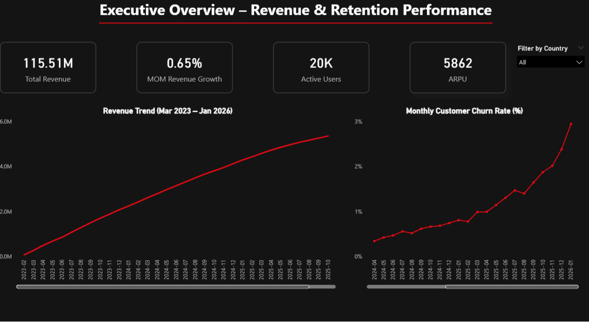

# 🎬 Netflix Subscription Analytics

## 📌 Project Overview
This is an end-to-end data analytics project analyzing Netflix subscription revenue, user behavior, and churn trends using MySQL and Power BI.

The dataset simulates a real-world subscription system with:
- 20,000 Users  
- 20,000 Subscriptions  
- 315,000+ Payment Records  
- 37 Months of Data  

The objective was to uncover revenue patterns, measure churn rate, and analyze customer lifetime value.

---

## 🛠 Tools & Technologies
- MySQL – Database & KPI queries  
- SQL (Advanced) – Joins, Window Functions, Correlated Subqueries  
- Python – Synthetic dataset generation  
- Power BI – Dashboard & Visualization  

---

## 📂 Database Structure
The project consists of four main tables:

- `users` – Stores user demographic and signup information  
- `subscriptions` – Tracks subscription start/end dates and plan mapping  
- `payments` – Contains monthly payment transactions  
- `plans` – Stores plan details such as plan name and pricing  

Key fields include:
- Subscription plan  
- Payment date  
- Monthly revenue  
- Churn status  
- Customer lifetime revenue  

---

## 📊 KPIs Implemented
- Total Revenue  
- Monthly Revenue Trend  
- Active vs Churned Users  
- Monthly Churn Rate  
- ARPU (Average Revenue per User)  
- Revenue by Plan  
- Customer Lifetime Value  
- Revenue Segmentation  

---

## 📊 Dashboard

### Executive Overview – Revenue & Retention Performance

### Revenue Drivers & Retention Dynamics

### Churn Risk & Retention

---

## 🚀 How to Reproduce
1. Import dataset into MySQL  
2. Run schema and KPI SQL queries  
3. Connect Power BI to MySQL  
4. Build visuals using calculated measures  

---

## 👨‍💻 Author
Lakshay Rana  
SQL | Python | Power BI
