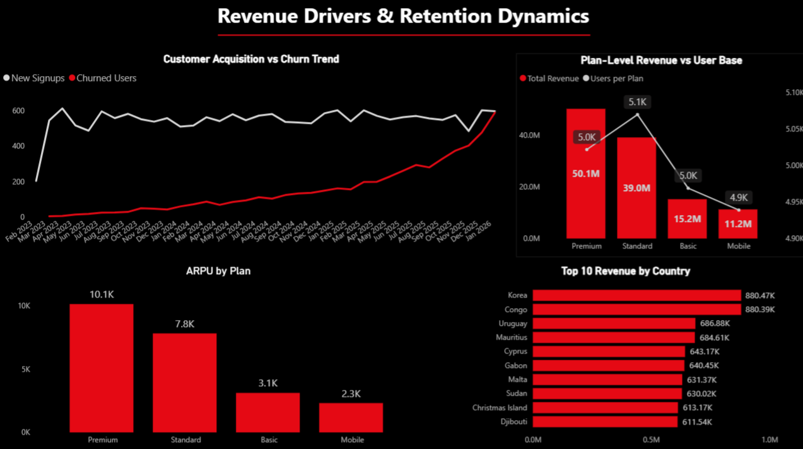
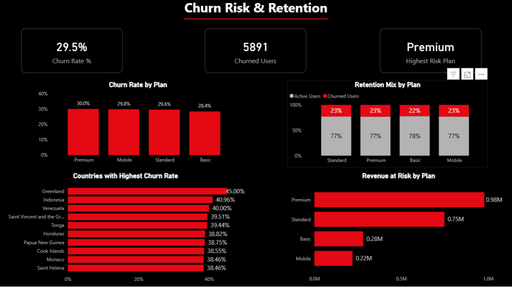

# 🎬 Netflix Subscription Analytics

## 📌 Project Overview
An end-to-end data analytics project analyzing Netflix subscription revenue, churn trends, customer retention behavior, and revenue concentration risk using MySQL, Python, and Power BI.

The dataset simulates a real-world subscription platform with:

- 20,000 Users  
- 20,000 Subscriptions  
- 315,000+ Payment Records  
- 37 Months of Data (Mar 2023 – Feb 2026)

The objective was to evaluate revenue sustainability, identify structural churn trends, assess monetization efficiency, and derive strategic business recommendations.

---

## 🛠 Tools & Technologies

- **Python** – Synthetic data generation & simulation  
- **MySQL** – Data modeling & KPI analytics  
- **SQL (Advanced)** – Aggregations, Joins, Window Functions, Correlated Subqueries  
- **Power BI** – Interactive dashboard & visualization layer  

---

## 📂 Repository Structure

```
netflix-subscription-analytics/
│
├── docs/
│   └── Netflix_Subscription_Analytics_Report.docx
│
├── python/
│   └── data_generation.py
│
├── sql/
│   ├── 01_core_kpis.sql
│   └── 02_advanced_analytics.sql
│
├── screenshots/
│   ├── executive_overview.png
│   ├── revenue_drivers_retention.png
│   └── churn_risk_retention.png
│
├── dashboard/
│   └── Netflix_Subscription_Analytics.pbix
│
└── README.md
```

---

## 📊 KPIs Implemented

- Total Revenue  
- Monthly Revenue Trend  
- Month-over-Month Revenue Growth  
- Active vs Churned Users  
- Monthly Churn Rate  
- ARPU (Average Revenue per User)  
- Revenue by Subscription Plan  
- Customer Lifetime Value  
- Revenue Segmentation & Contribution %  
- Revenue at Risk Analysis  

---

## 📊 Dashboard

### 1️⃣ Executive Overview – Revenue & Retention Performance


### 2️⃣ Revenue Drivers & Retention Dynamics


### 3️⃣ Churn Risk & Retention


---

## 📑 Detailed Business Report

A comprehensive business performance and retention analysis document is included:

📄 **[Download Full Business Analysis Report](docs/Netflix_Subscription_Analytics_Report.docx)**

The report covers:

- Revenue sustainability analysis  
- Churn lifecycle phase identification  
- Revenue concentration risk  
- Segment-level monetization insights  
- Strategic recommendations  
- Executive-level business interpretation  

---

## 🧠 Key Business Insights

- Revenue demonstrates stable recurring growth with natural base expansion effects.
- Churn shows a structural upward trend in later periods, indicating emerging retention pressure.
- Revenue is heavily concentrated within high-ARPA subscription tiers.
- Rising churn correlates with slowing revenue growth in late 2025.
- Revenue concentration introduces forward-looking financial risk.

---

## 🚀 How to Reproduce

1. Run `python/data_generation.py` to generate the synthetic dataset.  
2. Import data into MySQL.  
3. Execute queries inside `sql/01_core_kpis.sql` and `sql/02_advanced_analytics.sql`.  
4. Open `dashboard/Netflix_Subscription_Analytics.pbix` in Power BI.  
5. Review detailed business analysis in the `docs/` folder.

---

## 👨‍💻 Author

Lakshay Rana  
Data Analytics | SQL | Power BI | Python
